# 🚗 CarRental - Kurumsal Araç Kiralama & Blog Platformu

**CarRental**, .NET 8 Web API ve Core MVC mimarisiyle geliştirilmiş, modern araç kiralama süreçlerini yöneten uçtan uca bir platformdur. Proje, kurumsal standartlara uygun **Onion Architecture** prensipleriyle inşa edilmiştir.

---

## 📸 Proje Galerisi

### ⚙️ Operasyon ve Yönetim Panelleri
Sistemdeki tüm araçları, rezervasyon süreçlerini ve istatistikleri anlık olarak takip edebileceğiniz modern paneller.

<p align="center">
  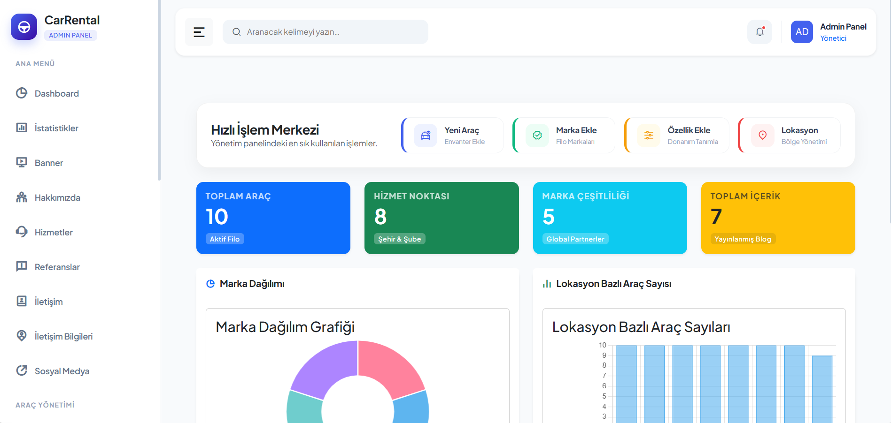
  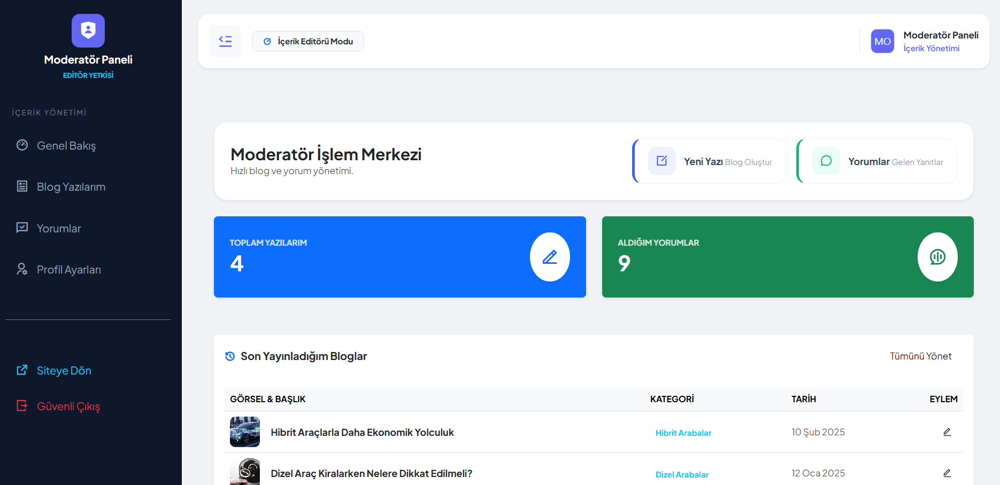
</p>
<p align="center">
  <em>(Sol: Admin Paneli, Sağ: Moderatör Paneli)</em>
</p>

---

### 👤 Kullanıcı İşlemleri ve Güvenlik
Güvenli giriş, kayıt ve profil yönetim ekranları.

<p align="center">
  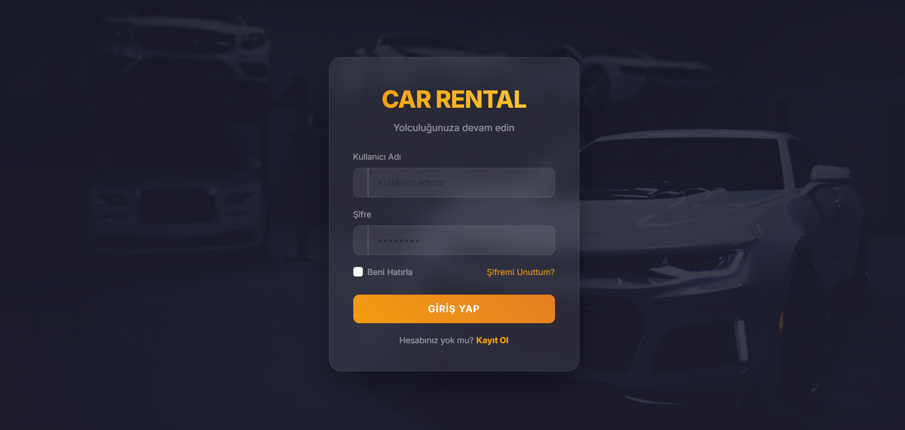
  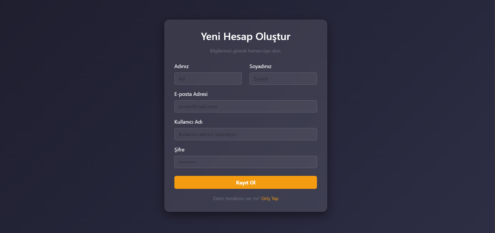
</p>
<p align="center">
  <em>(Sırasıyla: Giriş Yap, Kayıt Ol)</em>
</p>

---

### 🛠️ Yönetici (Admin) Paneli
Admin yetkisine sahip kullanıcıların erişebildiği, tüm operasyonun yönetildiği merkez.

<p align="center">
  
  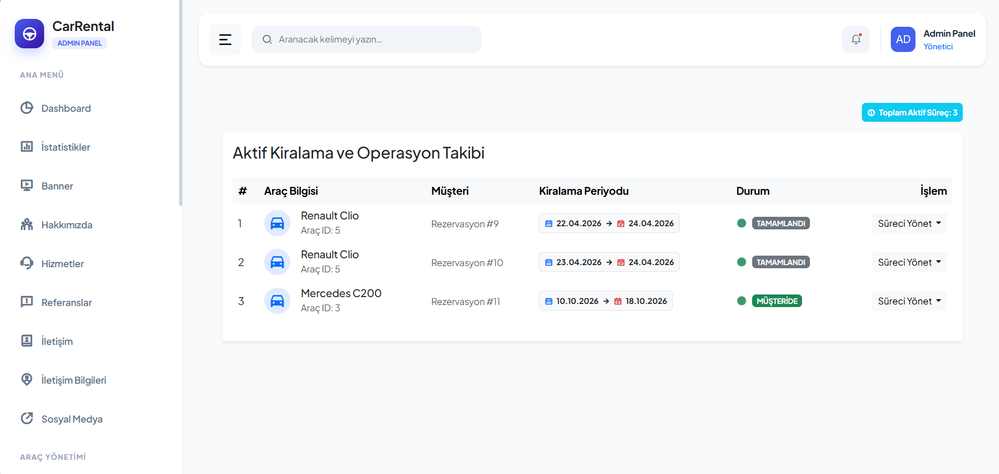
</p>
<p align="center">
  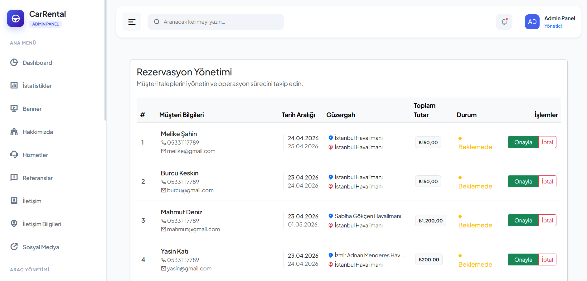
  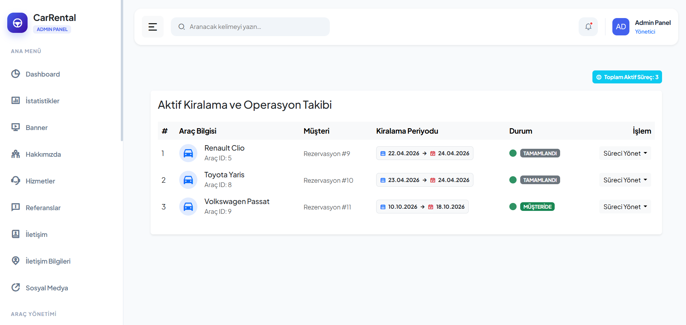
</p>

---

### 👤 Moderatör Paneli & Profil
Moderatörlerin içerik üretebildiği ve kendi bilgilerini yönettiği özel alan.

<p align="center">
  
  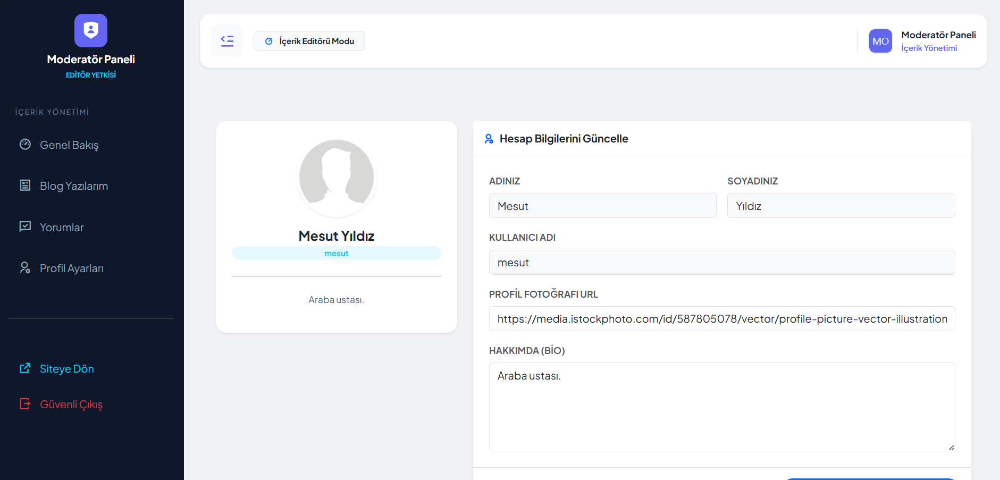
</p>

---

### 🚗 Araç Deneyimi ve Listeleme
Kullanıcıların araçları filtreleyebildiği ve detaylarını inceleyebildiği ekranlar.

<p align="center">
  
  
  
</p>

---

### 📊 Kiralama Süreci ve Kurumsal Sayfalar
Rezervasyon başlangıcındaki filtreleme ekranından kurumsal iletişim sayfalarına kadar tüm destek süreci.

<p align="center">
  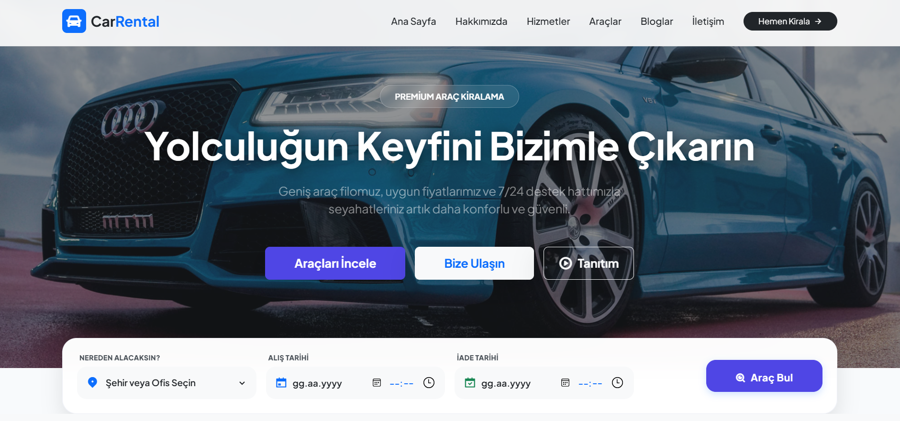
  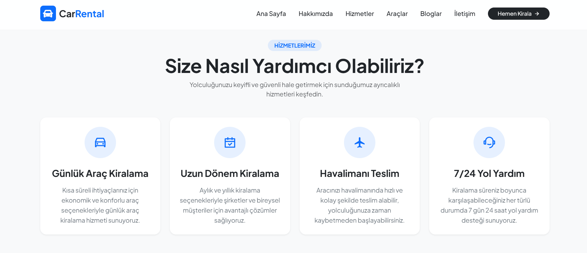
</p>
<p align="center">
  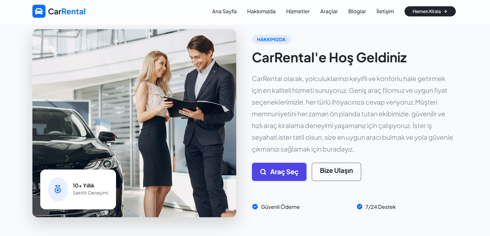
  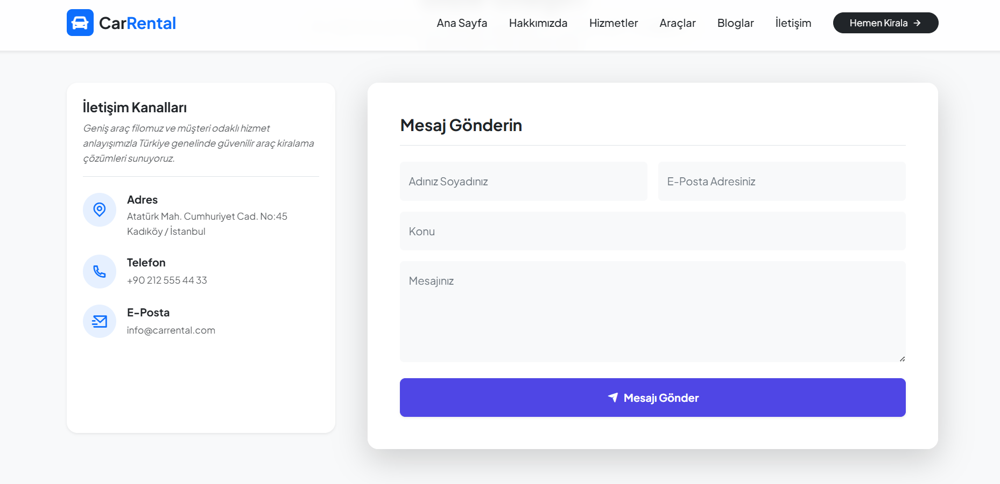
</p>

---

### 📝 Blog ve Etkileşim
Zengin blog içerikleri, yazar detayları ve kullanıcı yorumları.

<p align="center">
  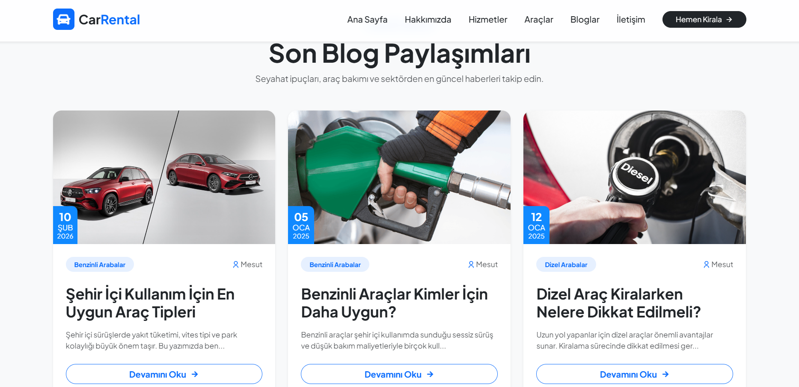
  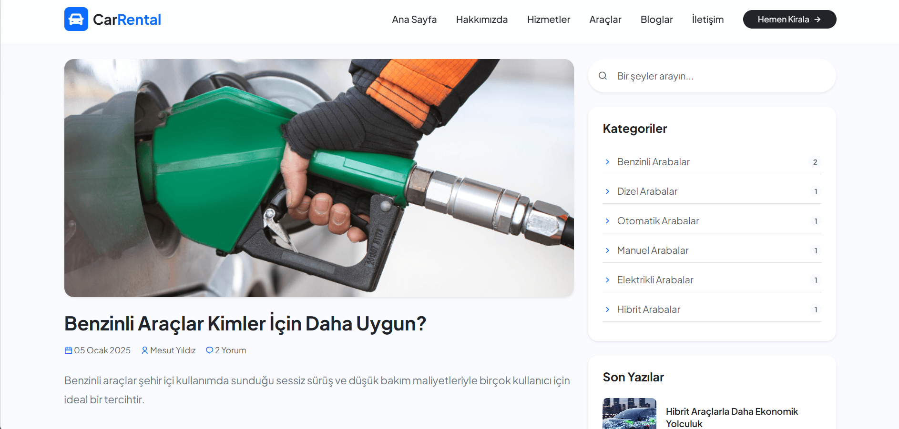
</p>
<p align="center">
  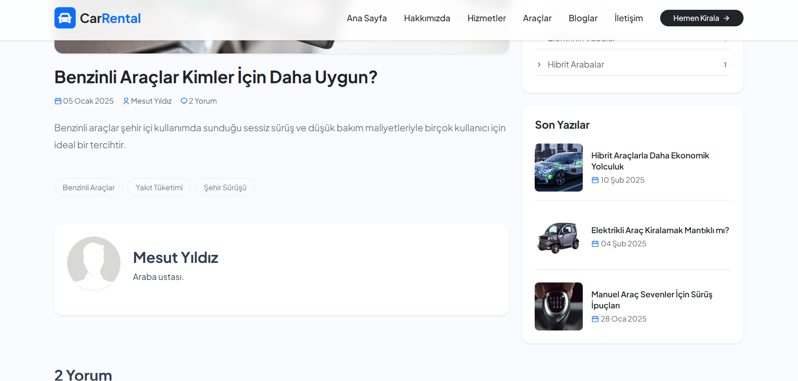
  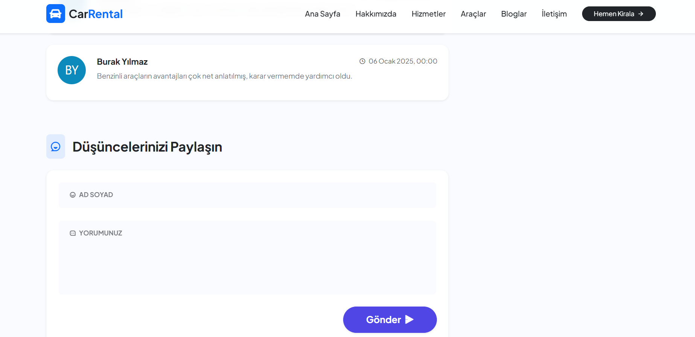
</p>
<p align="center">
  <em>(Sırasıyla: Blog Index, Blog Detay, Yorumlar ve Yorum Yapma Bölümleri)</em>
</p>

---

## ✨ Öne Çıkan Özellikler

### 🔐 Gelişmiş Yetkilendirme (RBAC)
- **Dinamik Rol Yönetimi:** Kullanıcıları Admin paneli üzerinden görüntüleme ve tek tıkla Moderatör yetkisi atama.
- **Güvenli Giriş:** BCrypt şifreleme ve JWT (JSON Web Token) tabanlı oturum yönetimi.

### 🚗 Rezervasyon & Operasyon
- **Kiralama Akışı:** Lokasyon, vites, yakıt gibi özelliklere göre araç arama ve rezervasyon süreci yönetimi.
- **Email Confirmation:** Rezervasyon tamamlandığında kullanıcıya gönderilen otomatik HTML onay e-postası.

### 🏗️ Mimari ve Teknik Altyapı
- **Onion Architecture:** Bağımlılıkları minimize eden, test edilebilir çok katmanlı yapı.
- **CQRS & Mediator:** MediatR ile ayrıştırılmış komut ve sorgu yönetimi.
- **Eager Loading:** EF Core ile ilişkili tabloların (`Include`) performanslı yönetimi.

---

## 🛠️ Teknolojiler

- **Backend:** C#, .NET 8, Web API
- **Design Patterns:** CQRS, Mediator, Repository, Unit of Work
- **Database:** MSSQL, Entity Framework Core (Code First)
- **Frontend:** ASP.NET Core MVC, Bootstrap 5, Remix Icons
- **Security:** JWT, User Secrets, BCrypt

---

## ⚙️ Kurulum ve Güvenlik

Proje güvenliği için hassas veriler `appsettings.json` yerine **Secret Manager**'da tutulmaktadır. Kurulum için:

1. **Repoyu klonlayın.**
2. **WebApi** projesine sağ tıklayıp **Manage User Secrets** diyerek aşağıdaki şablonu doldurun:

```json
{
  "ConnectionStrings": {
    "DefaultConnection": "Server=YOUR_SERVER_NAME;Database=CarRentalDb;Integrated Security=true;TrustServerCertificate=true;"
  },
  "Jwt": {
    "Key": "Minimum32KarakterlikGucluBirSecretKey",
    "Issuer": "CarRentalIdentity",
    "Audience": "CarRentalClients"
  },
  "EmailSettings": {
    "SmtpServer": "smtp.gmail.com",
    "SmtpPort": 587,
    "SenderEmail": "your-email@gmail.com",
    "SenderPassword": "your-app-password"
  }
}

```

3. Migration Uygulayın:
   Package Manager Console -> Update-Database

Geliştirici: EnessCode
